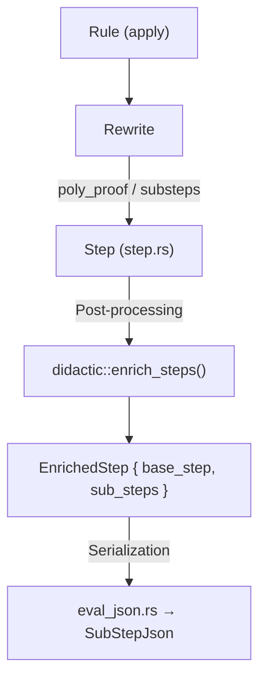

# Didactic Substeps Development

This skill documents how to add pedagogical substeps to ExpliCAS engine rules so users can see **concrete intermediate expressions** in the step-by-step view.

## Architecture Overview

There are **two independent SubStep systems** that both feed into the JSON output:



### 1. Engine-Level SubSteps (`step.rs::SubStep`)

Lightweight metadata attached to a `Rewrite` during rule application via `Rewrite::substep()`. These are **title + bullet lines** format (no LaTeX). They are always computed but are cheap.

```rust
// In a rule's apply() method:
Rewrite::new(before, after, "Rule description")
    .substep(step::SubStep::new(
        "Pattern Recognition",
        vec!["Detected a² - b²".into(), "a = x, b = 3".into()],
    ))
```

### 2. Didactic-Layer SubSteps (`didactic::SubStep`)

Rich post-processing substeps computed by `didactic::enrich_steps()`. These have **before/after expressions** with optional LaTeX. They are the ones shown in the web REPL with MathJax rendering.

```rust
// In a generate_*_substeps() function:
SubStep {
    description: "Expand products".to_string(),
    before_expr: "(t+1)(t+2)".to_string(),
    after_expr: "t² + 3t + 2".to_string(),
    before_latex: Some("(t+1)(t+2)".to_string()),
    after_latex: Some("{t}^{2} + 3t + 2".to_string()),
}
```

## Performance Contract

> [!IMPORTANT]
> Didactic computations **MUST NOT** run during normal simplification. They should only execute when step-by-step display is active.

### Pattern: Gate Expensive Computation Behind Proof Data

Expensive didactic work (e.g., computing expanded polynomial forms) should be done in the **rule itself** only when proof data is already being computed. The rule already produces proof data as part of its correctness verification, so the marginal cost is low.

```rust
// In a rule like try_opaque_zero():
// The polynomial expansion is already computed for verification.
// We just need to also store it for display:
let expanded_form_expr =
    crate::multipoly_display::expand_additive_terms(ctx, display_expr, &display_vars);

let proof = PolynomialProofData {
    // ... standard fields ...
    expanded_form_expr,  // ← Piggyback on existing computation
};
```

### Pattern: Post-Processing Only When Steps Are Requested

The `enrich_steps()` function is **only called** by the JSON/CLI presentation layer when `steps_mode == "on"`. The `StepMeta` field in `Step` is `Option<Box<StepMeta>>` — when steps are not needed, it stays `None` and no allocation occurs.

### Pattern: Use `new_compact` for Non-Display Steps

When step recording is in compact mode, use `Step::new_compact()` which skips the `format!()` call and sets `meta: None`.

## How to Add Substeps for a New Rule

### Step 1: Identify the Proof/Metadata Data

Determine what intermediate data the rule computes that would be pedagogically valuable. Common examples:

| Rule Type | Proof Data | Display Value |
|-----------|-----------|---------------|
| Polynomial identity | `PolynomialProofData` | Expanded terms before cancellation |
| Fraction sum | `FractionSumInfo` | LCD, numerator construction |
| Rationalization | Conjugate pair | Before/after multiplication |
| Nested fraction | Multiply-through structure | Step-by-step clearing |

### Step 2: Attach Proof Data to the Rewrite

Store the intermediate data in the `Rewrite` so it flows to the `Step`:

```rust
// Option A: Use existing poly_proof mechanism
let rewrite = Rewrite::new(before, after, "description")
    .poly_proof(proof_data);

// Option B: Use engine-level substeps (for simple title+lines)
let rewrite = Rewrite::new(before, after, "description")
    .substep(step::SubStep::new("Title", vec!["line1".into()]));
```

### Step 3: Create a `generate_*_substeps()` Function

Add a new function in either `didactic/nested_fractions.rs` or `didactic/fraction_steps.rs`:

```rust
pub fn generate_my_rule_substeps(ctx: &Context, step: &Step) -> Vec<SubStep> {
    let mut sub_steps = Vec::new();
    
    // Extract proof data from the step
    let proof = match step.poly_proof() {
        Some(p) => p,
        None => return sub_steps,
    };
    
    // Build substeps with CONCRETE expressions
    if let Some(expanded_id) = proof.expanded_form_expr {
        let expanded_latex = cas_ast::LaTeXExpr {
            context: ctx,
            id: expanded_id,
        }.to_latex();
        
        sub_steps.push(SubStep {
            description: "Expand products".to_string(),
            before_expr: format!("{}", DisplayExpr { context: ctx, id: original_id }),
            after_expr: format!("{}", DisplayExpr { context: ctx, id: expanded_id }),
            before_latex: Some(original_latex),
            after_latex: Some(expanded_latex),
        });
    }
    
    sub_steps
}
```

### Step 4: Register in the Dispatcher

In `didactic/mod.rs::enrich_steps()`, add a condition to call your new function:

```rust
// In the step loop inside enrich_steps():
if step.rule_name.contains("MyNewRule") {
    sub_steps.extend(generate_my_rule_substeps(ctx, step));
}
```

### Step 5: Gate by `is_chained()`

If the rule uses `ChainedRewrite` (multi-step decomposition already visible as separate engine Steps), **skip substep generation** to avoid duplication:

```rust
if step.rule_name.contains("GCD") && !step.is_chained() {
    sub_steps.extend(generate_gcd_substeps(ctx, step));
}
```

## LaTeX Rendering Contract

> [!WARNING]
> Plain text in substeps is **automatically wrapped in `\text{}`** by the JSON layer if `before_latex`/`after_latex` are `None`. If you want MathJax to render math formulas, you **MUST** set the LaTeX fields explicitly.

### Converting ExprId to LaTeX

```rust
let latex = cas_ast::LaTeXExpr {
    context: ctx,
    id: expr_id,
}.to_latex();
```

### Converting ExprId to Plain Text

```rust
let plain = format!("{}", cas_ast::DisplayExpr {
    context: ctx,
    id: expr_id,
});
```

## Reference: Existing Substep Generators

| Generator | File | Triggered By |
|-----------|------|-------------|
| `generate_fraction_sum_substeps` | `fraction_steps.rs` | Fraction sums in original expr |
| `generate_gcd_factorization_substeps` | `fraction_steps.rs` | `"Simplified fraction by GCD"` |
| `generate_nested_fraction_substeps` | `nested_fractions.rs` | `"complex/nested fraction"` rule names |
| `generate_rationalization_substeps` | `nested_fractions.rs` | `"Rationalize"` in description/rule |
| `generate_polynomial_identity_substeps` | `nested_fractions.rs` | `step.poly_proof().is_some()` |
| `generate_sum_three_cubes_substeps` | `nested_fractions.rs` | `"Sum of Three Cubes"` rule name |
| `generate_root_denesting_substeps` | `nested_fractions.rs` | `"Root Denesting"` rule name |

## Concrete Example: Opaque Polynomial Identity

For `(sin(u)+1)·(sin(u)+2) - sin(u)² - 3·sin(u) - 2`:

**Step 1** (in rule `try_opaque_zero`): Compute `expanded_form_expr` using `expand_additive_terms()` which splits into signed terms, expands each through multipoly independently, and recombines — gives `t² + 3t + 2 - t² - 3t - 2`.

**Step 2** (in `generate_polynomial_identity_substeps`): Build three substeps:
1. **"Sustitución para simplificar"**: Show original → `Sea t = sin(u)`
2. **"Expresión sustituida"**: Show `(t+1)(t+2) - t² - 3t - 2` → `t² + 3t + 2 - t² - 3t - 2`
3. **"Todos los términos se cancelan"**: Show "Expandir y agrupar" → `= 0`

Each substep has both `before_latex` and `after_latex` so MathJax renders the math correctly.

## Key Files

- `cas_engine/src/didactic/mod.rs` — Entry point, dispatcher, `EnrichedStep`/`SubStep` types
- `cas_engine/src/didactic/nested_fractions.rs` — Polynomial identity, rationalization, nested fraction generators
- `cas_engine/src/didactic/fraction_steps.rs` — Fraction sum, GCD factorization generators
- `cas_engine/src/step.rs` — `Step`, `StepMeta`, engine-level `SubStep`
- `cas_engine/src/rule.rs` — `Rewrite::poly_proof()`, `Rewrite::substep()`
- `cas_engine/src/multipoly_display.rs` — `PolynomialProofData`, `expand_additive_terms()`
- `cas_cli/src/commands/eval_json.rs` — JSON serialization, `\text{}` wrapping
