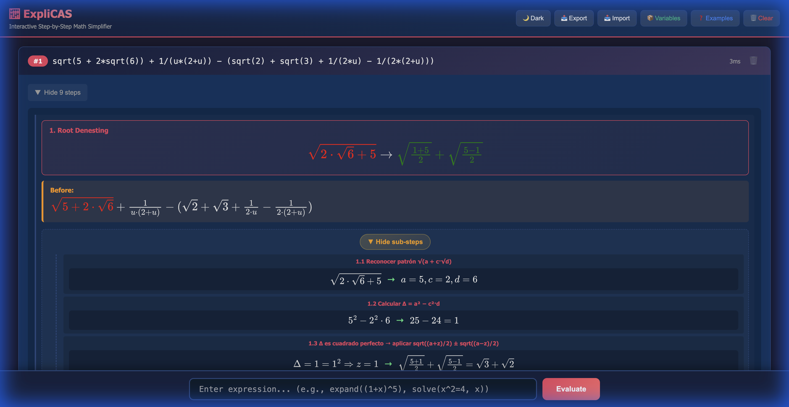

# ExpliCAS — a step-by-step Computer Algebra System in Rust

**ExpliCAS** is a Computer Algebra System written in Rust with a sharp north star: be **serious and universal across the real-domain university curriculum — and educational at every step.** Today that span covers single-variable calculus (with rational integration taken to its theoretical ceiling), multivariable and vector calculus, elementary complex arithmetic, the full elementary ODE course, and equation systems (linear n×n, parametric, and nonlinear bivariate). It does not merely return an answer; it shows the rules that produced it, keeps every decision **exact** (`BigRational`, never floating point), and — by design — **never returns a silent wrong answer.** When a result is genuinely out of reach, it says so honestly rather than guessing.

That combination is unusual. On its home turf ExpliCAS reaches results that trip up mainstream systems: it integrates **every** rational function (returning an exact parameterized form even for the cases where no closed radical form exists), keeps the **complete** periodic family of a trigonometric equation instead of truncating it, and refuses to hand back a finite number for a divergent integral.

## Live Demo

🌐 **Try it online:** [https://javileyes.github.io/ExpliCAS/](https://javileyes.github.io/ExpliCAS/)

**Browser-only mode (WebAssembly).** The full engine also compiles to WASM (~8 MB) and runs entirely client-side — same JSON wire, exact `BigRational` arithmetic, zero server. `scripts/build_pages_site.sh` assembles the static site and `.github/workflows/pages.yml` deploys it to GitHub Pages on every push to `main` (one-time activation: repo Settings → Pages → Source: *GitHub Actions*). The wasm build pins **nightly** Rust (stable's LLVM currently blows up on wasm32 codegen of the engine; fixed upstream) — native builds stay on stable. The classic server deployment (`web/server.py`) is unaffected: the frontend is dual-mode and picks the engine per `build-config.js`.



## Highlights

Every example below is real output from the current build (`target/release/cas_cli eval "…"`).

### 🏆 Universal rational integration

**Any** rational function `N(x)/D(x)` integrates. When the denominator factors over ℚ it stays there; when it needs an algebraic extension the surds appear only in the render; and when the coefficients live in a Galois-obstructed field with **no closed radical form at all**, the answer is emitted as an exact parameterized sum over the roots of a resolvent — the only elementary form that exists.

```text
integrate(1/(x^8+1), x)     →  the exact arctan+log closed form over √(2±√2)
                               (some mainstream CAS return a wrong "0" here)
integrate(1/(x^5-1), x)     →  conjugate quadratic pair over ℚ(√5)
integrate(1/(x^3-2), x)     →  real split over ℚ(∛2): log + arctan
integrate(1/(x^5-x-1), x)   →  root_sum(-2869·t^5 - …, t, t·ln(x - w(t)))
                               the Galois S₅ case: no radical form exists,
                               so the clean RootSum IS the answer
```

Definite integrals evaluate to the **exact** bound-substituted difference, certified pole-free by exact interval arithmetic — and honestly diverge otherwise:

```text
integrate(1/(x^3-2), x, 2, 3)         →  exact ∛2/arctan/log difference
approx(integrate(1/(x^5-x-1),x,2,3))  →  0.0132656737263   (decimal on demand)
integrate(1/(x^4-5), x, 1, 2)         →  undefined   (pole 5^(1/4) ≈ 1.495 inside)
```

### ✅ Honest by construction

Soundness is not a feature, it is the contract. A bad factorization degrades to an **honest residual**, never a wrong answer; a non-elementary integrand is left as itself; a divergent integral returns `undefined`.

```text
integrate(e^(x^2), x)   →  integrate(e^(x^2), x)   (no elementary antiderivative — kept)
diff(integrate(1/(x^3-2), x), x) - 1/(x^3-2)   →  0   (round-trip verified)
```

### 📐 Real breadth, one line each

| Domain | Example | Result |
|---|---|---|
| Limits | `limit((1+1/n)^n, n, infinity)` | `e` |
| Limits (∞−∞) | `limit(1/tan(x)^2 - 1/x^2, x, 0)` | `-2/3` |
| Trig equations | `solve(2*cos(x)-sqrt(3)=0, x)` | `{ π/6 + 2kπ, 11π/6 + 2kπ : k ∈ ℤ }` |
| Inequalities | `solve(sin(x) > 1/2, x)` | `{ (π/6+2kπ, 5π/6+2kπ) : k ∈ ℤ }` |
| Nested radicals | `sqrt(5 + 2*sqrt(6))` | `sqrt(2) + sqrt(3)` |
| Hyperbolic ID | `simplify((e^x-e^(-x))/(e^x+e^(-x)))` | `tanh(x)` |
| Series | `sum(1/n^2, n, 1, oo)` | `π²/6` |
| Closed forms | `sum(k^3, k, 1, n)` | `(n(n+1)/2)²` |
| Matrices | `[[1,1],[0,1]]^5` | `[[1, 5], [0, 1]]` |
| Number theory | `isprime(561)` | `0` (Carmichael, composite) |
| Equivalence | `equiv(cos(2*x), 1-2*sin(x)^2)` | `true` |

### 🎓 Educational at the core

Every transformation can be shown as an ordered chain of named rules, so the *why* is as available as the *what* — the reason the project exists.

> Backed by a **11,000+ test suite** (unit, integration, contract, and metamorphic property tests) plus differentiate-back verification on integration results — so the soundness contract above is enforced, not aspirational.

## Philosophy

Four principles drive every line of this engine. They are not aspirations — each one is enforced by machinery, and together they explain why the project grows the way it does.

### Universality, redefined

Mainstream CAS breadth means "accepts almost anything, is usually right." ExpliCAS inverts the deal: **within its declared domain, everything it emits is exact and verified; everything it cannot do is declined honestly with the reason named.** There is no gray zone of plausible-but-wrong output. This makes universality *monotonic*: the covered domain only grows, front by front, and every front that closes **stays** closed — pinned by contract tests, policy-matrix lanes (18 scorecard suites and counting), and footprint comparison on every change. Universality here is a direction of travel with a ratchet, not a marketing claim.

### Results are contracts

An answer is not just an expression — it carries the conditions under which it is valid. A parametric system's solution ships with its `det ≠ 0` requirement on a structured conditions channel; a domain restriction (`x > 0` for a Cauchy-Euler basis) is stated, not assumed; an implicit ODE solution names its verification route. And before anything is shown at all, **verification gates emission**: candidate solutions are substituted back into the *original* problem and must reduce to an exact, symbolic zero — solutions of ODEs against the ODE, solution pairs of nonlinear systems against *both* equations, integrals by differentiating back. What cannot be verified is not emitted.

### Honesty at the edges

A silent wrong answer is the one unforgivable bug. When the engine reaches the edge of its capability it returns an **honest residual** — the input echoed back with the precise reason it declined — and those declines are *published contract*: the help pages list what each command refuses and why. Two disciplines keep this rigorous. First, "no solution" is never just "I failed to find one" — claiming emptiness requires a separate completeness argument (exhaustive candidate enumeration), and without it the engine declines instead. Second, some residuals are *protected*: `∫e^(x²)`, divergent series, non-elementary forms — "resolving" them would be a soundness bug, and tests enforce that they stay honest forever.

### Educational as an equal half

The educational goal is not a layer on top — it is half the definition of done. Every solved family narrates its actual method with real mathematical content (the integrating factor found, the isolation performed, the indicial equation with its discriminant), localized in Spanish and English. The *why* is as available as the *what*. Honest declines teach too: naming the method that would be needed ("rank classification", "Gröbner bases", "power series") turns every boundary into a signpost. A capability is not considered finished until the universal half (exact, verified) and the educational half (narrated, honest) both land.

These four reinforce each other: verification is what makes universality safe to grow, contracts are what make results composable, honesty is what makes the boundaries trustworthy, and narration is what makes all of it teachable.

## Features

-   **Step-by-Step Simplification**: Shows every rule applied to transform an expression.
-   **Basic Arithmetic**: Addition, subtraction, multiplication, division, exponentiation. All exact (`BigRational`), never floating point.
-   **Calculus**:
    -   **Universal rational integration** — every `N(x)/D(x)` integrates: over ℚ, over algebraic extensions (`√`, `∛`, nested radicals), or as an exact `root_sum(...)` parameterized form for the Galois-obstructed cases with no closed radical form.
    -   Symbolic Integration with substitution, by-parts, partial fractions, and honest residuals for non-elementary integrands (`integrate(e^(x^2), x)` stays itself, never a wrong answer).
    -   **Definite integrals** by the Fundamental Theorem with **exact pole certification** — a pole inside the interval returns `undefined` (divergent), never a false finite value.
    -   Symbolic Differentiation (`diff(sin(x), x) -> cos(x)`), higher-order and mixed partials (`diff(f, x, y)`).
    -   **Limits** with a full educational toolkit: notable limits (`e` via `(1+1/n)^n`), iterated L'Hôpital, squeeze, `∞/∞` dominance hierarchy, and the `∞−∞` conjugate / common-denominator forms.
    -   **Numeric on demand**: `approx(...)` / `evalf(...)` render any exact result (including a `root_sum`) as a 12-digit decimal, while the engine stays exact everywhere else.
    -   Taylor/series expansion (`taylor(sin(x), x, 0, 5)`).
-   **Number Theory**:
    -   GCD/LCM (`gcd(12, 18) -> 6`, `lcm(4, 6) -> 12`).
    -   Modular Arithmetic (`mod(10, 3) -> 1`, `10 mod 3 -> 1`).
    -   Prime Factorization (`factors(12) -> 2^2 * 3`).
    -   Combinatorics (`fact(5) -> 120`, `choose(5, 2) -> 10`, `perm(5, 2) -> 20`).
-   **Algebraic Simplification**:
    -   Combining like terms (`2x + 3x -> 5x`).
    -   Polynomial expansion (`expand((x+1)^2) -> x^2 + 2x + 1`).
    -   Polynomial factorization (`factor(x^3 - x) -> x(x-1)(x+1)`).
    -   Grouping terms (`collect(ax + bx, x) -> (a+b)x`).
    -   Fraction simplification (`(x^2 - 1) / (x + 1) -> x - 1`).
-   **Functions**:
    -   Trigonometry (`sin`, `cos`, `tan`) with identities (`sin(2x) -> 2sin(x)cos(x)`).
    -   Logarithms (`log(x)`/`ln(x)` natural, `log10(x)` decimal, `log(base, x)` arbitrary base) with expansion (`ln(xy) -> ln(x) + ln(y)`).
    -   Roots (`sqrt(x)`, `sqrt(x, n)`).
    -   Absolute value (`abs(x)`).
-   **Equivalence Checking**: Verify if two expressions are equal (`equiv sin(x+y), sin(x)cos(y)+...`).
-   **Variables**: Symbolic computation with variables.
-   **Constants**: Built-in support for mathematical constants `e` and `pi`.
-   **Equation Solving**: Isolate variables in equations (`solve x+2=5, x`).
-   **Substitution**: Replace variables with values or other expressions.
-   **Interactive CLI**: Command-line interface with history support.
-   **Configuration**: Enable/disable specific simplification rules (e.g., `root_denesting`, `trig_double_angle`) via the `config` command.
-   **Step Verbosity Modes**: Control step-by-step output detail via `steps <mode>`:

    | Mode | Filtering | Display |
    |------|-----------|---------|
    | `none` | No steps | Only final result |
    | `succinct` | Medium+ | Compact (1 line/step: global expression only) |
    | `normal` | Medium+ | Detailed (rule name + local → global) |
    | `verbose` | All | Detailed including trivial steps |

    **Step Importance Levels** (controlled by `step.importance()` in `step.rs`):
    - **Trivial**: Identity operations (`x + 0 → x`, `x * 1 → x`, no-ops)
    - **Low**: Internal reorganizations (`Collect`, `Canonicalize`, `Sort`, `Evaluate`)
    - **Medium**: Standard algebraic transforms (`Product of Powers`, `Power of a Power`, etc.)
    - **High**: Major transformations (`Factor`, `Expand`, `Integrate`, `Differentiate`)
-   **Debug Tools** (Phase 2):
    -   **Rule Profiler**: Track rule application frequency for performance analysis (`profile enable/disable/clear`).
    -   **AST Visualizer**: Export expression trees to Graphviz DOT format (`visualize <expr>`).
    -   **Timeline HTML**: Generate interactive HTML visualization of simplification steps (`timeline <expr>`).
-   **Performance Optimized** (Phase 1):
    -   Conditional multi-pass simplification (-46.8% on complex fractions).
    -   Cycle detection prevents infinite loops.
    -   Early exit optimization for fast path.
-   **Context-Aware Pattern Detection** ★ (2025-12):
    -   Pre-analysis system that detects mathematical patterns before simplification.
    -   Prevents premature conversions (e.g., preserves Pythagorean identities like `sec²(x) - tan²(x) = 1`).
    -   Pattern marks thread through transformations via ParentContext.
    -   See [docs/ARCHITECTURE.md](docs/ARCHITECTURE.md#25-cas_engine---pattern-detection-infrastructure-) for details.
-   **High-Performance Polynomial GCD** ★★ (2025-12):
    -   **Zippel modular GCD algorithm** for multivariate polynomials.
    -   **fast benchmark** on the mm_gcd benchmark (7-variable, degree-7 polynomials).
    -   Rayon parallelism (8 points in parallel on 16 cores).
    -   FxHashMap + precomputed power tables for fast evaluation.
    -   Feature-gated for WASM/no-std compatibility.
    -   See [docs/ZIPPEL_GCD.md](docs/ZIPPEL_GCD.md) for technical details.
-   **Development Debug System** (tracing-based):
    -   Parametrizable debug logging with zero overhead when disabled.
    -   See [DEBUG_SYSTEM.md](DEBUG_SYSTEM.md) for usage details.
-   **Session Management**:
    -   Persistent **Session Store** with auto-incrementing IDs (`#1`, `#2`) to reference previous results.
    -   **Environment** for variable bindings (`let a = 5`, `b := a + 1`).
    -   **Deep Integration**: Use session references directly in `solve` (`solve #1, x`) and `equiv` (`equiv #1, #2`).
    -   Transitive substitution and cycle detection.
    -   See [ENVIRONMENT.md](ENVIRONMENT.md) for full documentation.
-   **Unicode Pretty Output** ★ (2025-12):
    -   By default, CLI displays mathematically formatted output: `3·x²` instead of `3 * x^2`.
    -   Unicode roots: `√x`, `∛x`, `∜x` instead of `sqrt(x)`.
    -   Superscript exponents for small integers (0-99): `x²`, `x³`, etc.
    -   Middle dot for multiplication: `·` instead of `*`.
    -   Use `--no-pretty` flag for ASCII compatibility: `cas_cli --no-pretty`.
-   **Branch Mode** ★ (2025-12):
    -   Two simplification modes for educational purposes:
        -   `strict` (default): Mathematically safe, inverse∘function compositions not simplified.
        -   `principal`: Assumes principal domain for inverse trig (e.g., `arctan(tan(x)) → x`).
    -   Switch modes via `mode strict` or `mode principal` in REPL.
    -   Principal branch mode emits domain warnings in step-by-step output.
-   **Context Mode** ★ (2025-12):
    -   Context-aware simplification that adapts rules based on the operation being performed:
        -   `auto` (default): Auto-detect context from expression (e.g., `integrate()` → IntegratePrep).
        -   `standard`: Default safe simplification rules only.
        -   `solve`: Disable rules that introduce `abs()` or piecewise forms (solver-friendly).
        -   `integrate`: Enable integration preparation transforms (Werner, Morrie's law, etc.).
    -   Switch modes via `context auto|standard|solve|integrate` in REPL.
    -   **Integration Prep Rules**:
        -   `2·sin(A)·cos(B) → sin(A+B) + sin(A-B)` (Werner product-to-sum)
        -   `cos(x)·cos(2x)·cos(4x) → sin(8x)/(8·sin(x))` (Morrie's law telescoping)
    -   Domain warnings are deduplicated and show their source rule.
-   **Steps Mode** ★ (2025-12):
    -   Control step recording for performance optimization:
        -   `on` (default): Full step recording with before/after snapshots.
        -   `compact`: Record steps without expression snapshots (memory-efficient).
        -   `off`: No step recording (fastest, ~9% improvement on batch workloads).
    -   Switch modes via `steps on|off|compact` in REPL.
    -   **Prompt Indicator**: Shows `[steps:off]` or `[steps:compact]` when not in default mode.
    -   **Domain Warnings Survive**: Even with `steps off`, domain assumptions are preserved.
    -   **Benchmarks**: `off` provides ~9% speedup on batch, ~7% on light expressions.
-   **Auto-expand Mode** ★ (2025-12):
    -   **Intelligent expansion**: Only expands `Pow(Add(..), n)` in contexts where cancellation is likely.
    -   **Policy**: By default `simplify()` preserves factored forms like `(x+1)^2`. Use `autoexpand on` for intelligent expansion, or `expand()` for explicit expansion.
    -   Switch modes via `autoexpand on|off` in REPL.
    -   **Prompt Indicator**: Shows `[autoexp:on]` when enabled.
    -   **Context Detection** (marks Div/Sub nodes for expansion):
        -   Difference quotients: `((x+h)^n - x^n)/h` → expands to simplify
        -   **Sub cancellation**: `(x+1)^2 - (x^2+2x+1)` → **detects and returns 0**
        -   Standalone `(x+1)^3` → stays factored (no cancellation context)
    -   **Zero-Shortcut** (★ Phase 2): Compares expressions as MultiPoly without AST expansion.
        -   If `P - Q = 0` → returns 0 immediately (no explosion)
    -   **Solve Mode Firewall**: `ContextMode::Solve` blocks auto-expand for solver-friendly forms.
    -   **Budget Limits** (prevent explosion):
        -   `max_pow_exp: 4` — Maximum exponent
        -   `max_base_terms: 4` — Maximum terms in base
        -   `max_generated_terms: 300` — Maximum terms in result
        -   `max_vars: 4` — Maximum variables
    -   See [POLICY.md](POLICY.md) for the `simplify()` vs `expand()` contract.
-   **Profile Cache** ★ (2025-12):
    -   Rule profiles cached automatically in `SessionState` to avoid rebuilding ~30 rules per evaluation.
    -   First evaluation builds and caches the profile; subsequent evaluations reuse `Arc<RuleProfile>`.
    -   **CLI Commands**:
        -   `cache` or `cache status` — Show number of cached profiles
        -   `cache clear` — Clear all cached profiles (will rebuild on next eval)
        -   `reset full` — Clear session state AND profile cache
    -   **Library Usage**:
        ```rust
        use cas_engine::{SessionState, Simplifier};
        
        let mut state = SessionState::new();
        let profile = state.profile_cache.get_or_build(&opts);
        let simplifier = Simplifier::from_profile(profile);
        ```
    -   See [ARCHITECTURE.md](ARCHITECTURE.md#211-cas_engine---profile-cache--2025-12) for implementation details.

## Getting Started

### What You Need

To run ExpliCAS locally, including the web application in `web/server.py`, you need:

-   **Git** to clone the repository
-   **Rust 1.88+** and **Cargo**
-   **Python 3** to run the web server
-   A basic **C/C++ build toolchain** for compiling Rust crates

The simplest cross-platform way to install Rust and Cargo is **rustup**.

### Install Dependencies On macOS

```bash
# 1) Install Apple command line build tools
xcode-select --install

# 2) Install Homebrew if you do not already have it
/bin/bash -c "$(curl -fsSL https://raw.githubusercontent.com/Homebrew/install/HEAD/install.sh)"

# 3) Install Git and Python 3
brew install git python

# 4) Install Rust + Cargo via rustup
curl --proto '=https' --tlsv1.2 -sSf https://sh.rustup.rs | sh -s -- -y

# 5) Load Cargo into your shell
source "$HOME/.cargo/env"

# 6) Verify the tools are available
git --version
python3 --version
rustc --version
cargo --version
```

### Install Dependencies On Linux

#### Ubuntu / Debian

```bash
sudo apt update
sudo apt install -y build-essential curl git python3

curl --proto '=https' --tlsv1.2 -sSf https://sh.rustup.rs | sh -s -- -y
source "$HOME/.cargo/env"

git --version
python3 --version
rustc --version
cargo --version
```

#### Fedora

```bash
sudo dnf install -y gcc gcc-c++ make curl git python3

curl --proto '=https' --tlsv1.2 -sSf https://sh.rustup.rs | sh -s -- -y
source "$HOME/.cargo/env"

git --version
python3 --version
rustc --version
cargo --version
```

For other Linux distributions, install the equivalents of `git`, `curl`, `python3`, and a native build toolchain, then install Rust with `rustup`.

### Clone And Build ExpliCAS

```bash
git clone https://github.com/javileyes/ExpliCAS.git
cd ExpliCAS

# Build the CLI binary used by both the REPL and the web app
cargo build --release -p cas_cli
```

### Run The CLI

```bash
./target/release/cas_cli
```

### Run The Web Application

The web server is a small Python HTTP server that shells out to the compiled CLI binary at `./target/release/cas_cli`.

```bash
# From the repository root
python3 web/server.py
```

Then open [http://localhost:8080](http://localhost:8080).

If your system maps `python` to Python 3, this also works:

```bash
python web/server.py
```

### Verify The Installation

```bash
# CLI smoke test
./target/release/cas_cli eval "x^2 + 2*x + 1"

# Web app
python3 web/server.py
# then open http://localhost:8080
```

### CLI Options

```bash
# Start interactive REPL (default)
./target/release/cas_cli

# Evaluate a single expression (text output)
./target/release/cas_cli eval "x^2 + 1"

# Evaluate with JSON output
./target/release/cas_cli eval "x^2 + 1" --format json

# Use budget presets: small, cli (default), unlimited
./target/release/cas_cli eval "expand((a+b)^10)" --budget small

# Fail-fast on budget exceeded (vs best-effort default)
./target/release/cas_cli eval "expand((a+b)^200)" --budget small --strict

# ASCII output (*, ^) instead of Unicode (·, ²)
./target/release/cas_cli --no-pretty

# Show help
./target/release/cas_cli --help
./target/release/cas_cli eval --help
```

> **Tip**: Use `cargo run -p cas_cli --release --` prefix during development:
> ```bash
> cargo run -p cas_cli --release -- eval "x+1" --format json
> ```

### Output Examples

| Mode | Input | Output |
|------|-------|--------|
| Pretty (default) | `x^2 * 3` | `3·x²` |
| ASCII (`--no-pretty`) | `x^2 * 3` | `3 * x^(2)` |

> **Note**: When using `cargo run`, add `--` before program arguments:
> ```bash
> cargo run -p cas_cli -- --no-pretty
> ```


## Otras Características

- **Simplificación algebraica** paso a paso
- **Resolución de ecuaciones** con múltiples soluciones y casos especiales
- **Derivadas simbólicas** con reglas explicativas
- **Verificación de equivalencia** entre expresiones
- **Factorización** (cuadráticas, diferencia de cuadrados)
- **Expansión** (binomios con potencias)
- **Trigonometría** (evaluación e identidades)
- **Logaritmos y exponenciales**
- **Teoría de números** (LCM, módulo, factorización prima, combinatoria)
- **Control de verbosidad**: minimal/low/normal/verbose
- **Perfiles** de expresiones (análisis de comp lejidad)

## Ejemplos de Uso

### 1. Simplificación Básica
de the CLI, try these expressions to see the step-by-step engine in action:

#### 1. Polynomial Factorization
The engine uses the Rational Root Theorem to factor polynomials.
```text
> factor(x^3 - x)
```
**Output:**
```
Steps:
1. Factor polynomial using Rational Root Theorem
   -> x * (x^2 - 1)
2. Factor difference of squares
   -> x * (x - 1) * (x + 1)
Result: x * (x - 1) * (x + 1)
```

#### 2. Advanced Trigonometry
Simplifies complex trigonometric expressions using double angle and sum identities.
```text
> sin(2*x) + 2*sin(x)*cos(x)
```
**Output:**
```
Steps:
1. sin(2x) = 2sin(x)cos(x) [Double Angle Identity]
   -> 2 * sin(x) * cos(x) + 2 * sin(x) * cos(x)
2. Combine like terms
   -> 4 * sin(x) * cos(x)
Result: 4 * sin(x) * cos(x)
```

#### 3. Logarithm Expansion & Simplification
Automatically expands products/quotients and simplifies inverses.
```text
> ln(x^2 * y) - 2*ln(x)
```
**Output:**
```
Steps:
1. ln(x*y) = ln(x) + ln(y)
   -> ln(x^2) + ln(y) - 2 * ln(x)
2. ln(x^y) = y * ln(x)
   -> 2 * ln(x) + ln(y) - 2 * ln(x)
3. Combine like terms (2ln(x) - 2ln(x) = 0)
   -> ln(y)
Result: ln(y)
```

#### 4. Symbolic Integration
Basic indefinite integration support.
```text
> integrate(x^2 + sin(x), x)
```
**Output:**
```
Result: x^3 / 3 - cos(x)
```

#### 5. Symbolic Differentiation
Computes derivatives using product, quotient, and chain rules.
```text
> diff(x * sin(x), x)
```
**Output:**
```
Result: sin(x) + x * cos(x)
```

#### 6. Number Theory
Perform integer arithmetic operations like GCD, LCM, and prime factorization.
```text
> factors(2345)
```
**Output:**
```
Result: 5 * 7 * 67
```
```text
> gcd(12, 18)
```
**Output:**
```
Result: 6
```
```text
> 5!
```
**Output:**
```
Result: 120
```
```text
> choose(5, 2)
```
**Output:**
```
Result: 10
```
```text
> 25 mod 7
```
**Output:**
```
Result: 4
```

#### 8. Educational Mode (`explain` Command)
Get detailed, step-by-step explanations of mathematical algorithms. Currently supports GCD with the Euclidean algorithm.

**Integer GCD:**
```text
> explain gcd(48, 18)
```
**Output:**
```
Educational Steps:
────────────────────────────────────────────────────────────
Intentando GCD numérico entre 48 y 18
Algoritmo de Euclides para enteros:
Calculamos GCD(48, 18)
Dividimos 48 entre 18: Cociente = 2, Resto = 12
   → Como el resto es 12, el nuevo problema es GCD(18, 12)
Dividimos 18 entre 12: Cociente = 1, Resto = 6
   → Como el resto es 6, el nuevo problema es GCD(12, 6)
Dividimos 12 entre 6: Cociente = 2, Resto = 0
   → El resto es 0. ¡Hemos terminado!
El Máximo Común Divisor es: 6
────────────────────────────────────────────────────────────
Result: 6
```

**Polynomial GCD:**
```text
> explain gcd(2*x^2 + 7*x + 3, 2*x^2 + 5*x + 2)
```

**Multivariate Support:** The engine now supports multivariate polynomial GCD via the Zippel algorithm. See [docs/ZIPPEL_GCD.md](docs/ZIPPEL_GCD.md) for technical details.

#### 9. Matrix Operations
Perform basic matrix operations including determinant, transpose, and trace.

**Determinant (up to 3×3):**
```text
> det [[1, 2], [3, 4]]
Result: -2

> det [[2]]
Result: 2
```

**Transpose:**
```text
> transpose [[1, 2, 3], [4, 5, 6]]
Result: [[1, 4], [2, 5], [3, 6]]
```

**Trace (sum of diagonal):**
```text
> trace [[1, 2], [3, 4]]
Result: 5
```

**Supported matrices:** Any size for transpose and trace. Determinant supports 1×1, 2×2, and 3×3 matrices.

#### 10. Pre-Calculus (Absolute Value & Inequalities)
The solver handles absolute values (branching) and inequalities (sign flipping).

**Example: Absolute Value Equation**
```text
> solve |2*x + 1| = 5, x
Steps:
1. Split absolute value (Case 1): 2 * x + 1 = 5
   -> 2 * x = 4
   -> x = 2
2. Split absolute value (Case 2): 2 * x + 1 = -5
   -> 2 * x = -6
   -> x = -3
Result: x = 2
--- Solution 2 ---
Result: x = -3
```

**Example: Inequality**
```text
> solve -2*x < 10, x
Steps:
1. Divide both sides by -2 (flips inequality)
   -> x > -5
Result: (-5, infinity)
```

**Example: Absolute Value Inequality (Intersection)**
```text
> solve |x| < 5, x
Steps:
1. Split absolute value (Case 1): x < 5
2. Split absolute value (Case 2): x > -5
Result: (-5, 5)
```

**Example: Absolute Value Inequality (Union)**
```text
> solve |x| > 5, x
Steps:
1. Split absolute value (Case 1): x > 5
2. Split absolute value (Case 2): x < -5
Result: (-infinity, -5) U (5, infinity)
```

#### 11. Equivalence Checking
Verify if two expressions are mathematically equivalent. The command returns:
- **True** — Unconditionally equivalent
- **True (conditional)** — Equivalent under domain conditions
- **False** — Demonstrably not equivalent
- **Unknown** — Cannot determine

```text
> equiv sin(x+y), sin(x)*cos(y) + cos(x)*sin(y)
```
**Output:** `True`

**Conditional Equivalence Examples:**
```text
> equiv (x - 27) / (x^(2/3) + 3*x^(1/3) + 9), x^(1/3) - 3
True (conditional)
ℹ️ Requires:
  • 9 + x^(2/3) + 3·x^(1/3) ≠ 0

> equiv tan(x) * tan(pi/3 - x) * tan(pi/3 + x), tan(3*x)
True (conditional)
ℹ️ Requires:
  • cos(x) ≠ 0
  • cos(x + pi / 3) ≠ 0
  • cos(pi / 3 - x) ≠ 0
```

#### 12. Equation Solving
```text
> solve 2 * sin(x) = 1
```
**Output:**
```
Steps:
1. Divide both sides by 2
   -> sin(x) = 1/2
2. Take arcsin of both sides
   -> x = arcsin(1/2)
3. arcsin(1/2) = pi/6
   -> x = pi / 6
Result: x = pi / 6
```

#### 13. Variable Substitution
```text
> subst x^2 + x, x, 3
```
**Output:** `12`

**Power-aware Substitution:**
```text
> subst x^4 + x^2 + 1, x^2, y
```
**Output:** `y² + y + 1`

### Advanced Examples

ExpliCAS can handle complex symbolic identities and simplifications.

#### 1. Ramanujan's Nested Roots
Simplifies nested square roots automatically.
```text
> sqrt(3 + 2*sqrt(2))
```
**Output:** `1 + sqrt(2)`

#### 2. Logarithmic Mirror
Simplifies complex exponential and logarithmic identities.
```text
> x^(1/ln(x))
```
**Output:** `e`

#### 3. Trigonometric Identities
Verifies complex identities like the triple angle formula.
```text
> simplify sin(3*x) - (3*sin(x) - 4*sin(x)^3)
```
**Output:** `0`

#### 4. Rational Simplification
Handles polynomial division and simplification.
```text
> (x^3 - 1) / (x - 1)
```
**Output:** `x^2 + x + 1`

#### 5. Trigonometric Summation (Dirichlet Kernel)
Automatically proves telescoping identities using pattern detection:
```text
> 1 + 2*cos(x) + 2*cos(2*x) - sin(5*x/2)/sin(x/2)
Steps:
1. Dirichlet Kernel Identity: 1 + 2Σcos(kx) = sin((n+½)x)/sin(x/2) for n=2
   [Trig Summation Identity]
Result: 0
```

For detailed step-by-step proof, use the `telescope` command:
```text
> telescope 1 + 2*cos(x) + 2*cos(2*x) - sin(5*x/2)/sin(x/2)

═══════════════════════════════════════════════════════════════
                TELESCOPING PROOF
═══════════════════════════════════════════════════════════════

Step 1: Dirichlet Kernel Identity: 1 + 2Σcos(kx) = sin((n+½)x)/sin(x/2) for n=2
  Before: 2·cos(2x) + 1 + 2·cos(x) - sin(5x/2)/sin(x/2)
  After:  0

✓ PROVED: Expression equals 0 by telescoping cancellation
═══════════════════════════════════════════════════════════════
```

**Supported patterns:** `1 + 2*cos(x) + 2*cos(2x) + ... + 2*cos(nx) - sin((n+½)x)/sin(x/2)`

#### 6. Finite Summation
Compute finite sums with `sum(expr, var, start, end)`:
```text
> sum(k, k, 1, 10)
Result: 55       (1+2+...+10)

> sum(k^2, k, 1, 5)
Result: 55       (1+4+9+16+25)

> sum(2*k + 1, k, 1, 5)
Result: 35       (3+5+7+9+11)
```

#### 7. Finite Product (Productorio)
Compute finite products with `product(expr, var, start, end)`:
```text
> product(k, k, 1, 5)
Result: 120      (5! = 1*2*3*4*5)

> product((k+1)/k, k, 1, n)
Result: 1 + n    (Telescopic: (2/1)*(3/2)*...*(n+1)/n = n+1)

> product((k+1)/k, k, 1, 10)
Result: 11       (Simplified telescopic result)
```

**Telescoping detection:** The engine automatically detects `(k+a)/(k+b)` patterns and applies multiplicative telescoping, avoiding expensive factorial computations.

### Configuration & Rule Toggling
 
You can dynamically enable or disable specific simplification rules directly from the CLI. This is useful for educational purposes (showing intermediate steps without full simplification) or for debugging.
 
#### Listing Rules
To see all available configurable rules and their current status:
```text
> config list
```
**Output:**
```
Enabled Rules:
  - Distributive Property
  - Simplify Fractions
  ...
Disabled Rules:
  - (none)
```
 
#### Disabling a Rule
To prevent a specific rule from applying:
```text
> config disable trig_double_angle
Rule 'trig_double_angle' set to false.
```
Now, expressions like `sin(2*x)` will **not** be simplified to `2*sin(x)*cos(x)`.
 
#### Enabling a Rule
To re-enable a rule:
```text
> config enable trig_double_angle
Rule 'trig_double_angle' set to true.
```
 
#### Restoring Defaults
To reset all rules to their default state:
```text
> config restore
All rules restored to default values.
```

### Pipeline Settings (Phase Control)

Control the simplification pipeline phases interactively. This is useful for debugging and understanding engine behavior.

#### Setting Pipeline Options
```text
> set transform off       # Disable distribution & expansion
Transform phase DISABLED (no distribution/expansion)

> set rationalize off     # Disable auto-rationalization
Rationalization DISABLED

> set rationalize 1.5     # Set level (0, 1, or 1.5)
Rationalization set to Level 1.5 (same-surd products)

> set max-rewrites 100    # Safety limit on total rewrites
Max rewrites set to 100

> set debug on            # Show pipeline diagnostics
Debug mode ENABLED
```

#### Pipeline Diagnostics
With `set debug on`, each simplification shows detailed stats:
```text
> x/(1+sqrt(2))

──── Pipeline Diagnostics ────
  Core:       2 iters, 3 rewrites
  Transform:  1 iters, 0 rewrites, changed=false
  Rationalize: Level15
              → Applied ✓
  PostCleanup: 1 iters, 0 rewrites
  Total rewrites: 5
───────────────────────────────

Result: x * (√2 - 1)
```

#### Viewing Current Settings
```text
> set
Pipeline settings:
  set transform <on|off>
  set rationalize <on|off|0|1|1.5>
  set max-rewrites <N>
  set debug <on|off>

Current settings:
  transform: on
  rationalize: Level15
  max-rewrites: 300
  debug: off
```

### Debug Tools

ExpliCAS includes powerful debugging and visualization tools for developers and educators.

#### Rule Profiler

Track which rules are being applied and how often:

```text
> profile enable
Profiler enabled.

> (x+1)^2
Result: x^2 + 2*x + 1

> profile
Rule Profiling Report
─────────────────────────────────────────────
Rule                                      Hits
─────────────────────────────────────────────
Binomial Expansion                           1
Combine Like Terms                           2
─────────────────────────────────────────────
TOTAL                                        3

> profile clear
Profiler statistics cleared.
```

#### Health Report

Monitor engine health with two modes:

**Explain Mode** (inline diagnostics):
```text
> set debug on
Debug mode ENABLED

> (1+x)^5
──── Pipeline Diagnostics ────
  Core:       2 iters, 9 rewrites
  Transform:  1 iters, 0 rewrites, changed=false
  Rationalize: Off
  PostCleanup: 1 iters, 0 rewrites
  Total rewrites: 10
───────────────────────────────

Result: x^(5) + 5 * x^(4) + 10 * x^(3) + 10 * x^(2) + 5 * x + 1
```

**Health Command** (standalone tracking):
```text
> health on
Health tracking ENABLED

> x/(1+sqrt(2))
Result: x * (-1 + √(2))

> health
Rule Health Report
────────────────────────────────────────────────────────────────
Top Applied Rules:
  Canonicalize Negation                       2
  Rationalize Binomial Denominator            1
────────────────────────────────────────────────────────────────
```

#### Cycle Detection

The engine automatically detects "ping-pong" patterns where rules undo each other:

```text
  Transform:  15 iters, 42 rewrites, changed=true
              ⚠ Cycle detected: period=2 at rewrite=37 (stopped early)
              Likely contributors: Distribute=20, Factor Common Term=18
```

When a cycle is detected:
- The phase stops immediately (treated as fixed-point)
- Top contributing rules are shown for diagnosis
- Zero overhead when health is disabled

#### Pipeline Control

Fine-tune simplification behavior:

```text
> set transform off      # Disable distribution/expansion
> set rationalize off    # Disable auto-rationalization
> set rationalize 1      # Only simple denominators (√2 → rationalize)
> set rationalize 1.5    # Level 1 + binomials (1+√2 → rationalize)
> set max-rewrites 50    # Limit total rewrites
```

#### Polynomial Display

Results are automatically ordered by degree (descending):

```text
> (1+x)^3
Result: x^(3) + 3 * x^(2) + 3 * x + 1

> 5 + x^2 + 3*x
Result: x^(2) + 3 * x + 5
```

This produces the standard mathematical form: highest degree first, constant term last.

#### Health Metrics Summary

| Metric | Meaning |
|--------|---------|
| Top Applied Rules | Rules firing most often (potential churn) |
| Semantic Rejections | Rules blocked because result equals input |
| Growth Rules | Rules increasing expression size |
| Cycle Detected | Ping-pong pattern found, phase stopped |

#### AST Visualizer

Export expression trees to Graphviz DOT format for visual debugging:

```text
> visualize (x+1)*(x-1)
AST exported to ast.dot
Render with: dot -Tsvg ast.dot -o ast.svg
```

Then render the tree:
```bash
$ dot -Tsvg ast.dot -o ast.svg
$ open ast.svg  # Opens beautiful tree visualization
```

#### Timeline HTML

Generate interactive HTML visualization of simplification steps with intelligent filtering:

```text
> timeline 1/(sqrt(x)+1)+1/(sqrt(x)-1)-(2*sqrt(x))/(x-1)
Timeline exported to timeline.html
Open in browser to view interactive visualization.
```

**Features:**
- **Intelligent Step Filtering**: Automatically filters out non-productive steps (where global state doesn't change) and low-importance canonicalization steps
  - Reduces visual clutter (e.g., 47 steps → 13 meaningful steps)
  - Configurable verbosity: `Low`, `Normal`, `Verbose`
- **Compact Layout**: 
  - Shows only the current expression (removed redundant "After" state)
  - Displays rule name and local transformation
  - Final result clearly highlighted
- **Smart LaTeX Rendering**:
  - Global expressions use readable notation (e.g., `√x` for roots)
  - Rule transformations preserve mathematical notation for clarity:
    - Exponent rules show fractional notation: `x^{1/2} → x^{1/2·2}`
    - Other rules use standard notation with roots
- **Professional Styling**:
  - MathJax-rendered expressions
  - Gradient backgrounds and color-coded sections
  - Responsive design with smooth animations

**Step Importance Levels:**
- **Trivial**: Identity operations (Add Zero, Mul By One) - hidden by default
- **Low**: Canonicalization, sorting, constant evaluation - hidden in Normal mode
- **Medium**: Standard algebraic transforms - always shown
- **High**: Major transformations (Factor, Expand, Integrate) - always highlighted

## Desarrollo y Verificación

### Requisitos
- Rust 1.88 o superior (MSRV)
- Cargo (incluido con Rust)

### Comandos rápidos
```bash
# CI completo (recomendado)
make ci

# Build solo
cargo build --release -p cas_cli
./target/release/cas_cli
```


### Running Tests

To verify the correctness of the system, run the test suite:

```bash
cargo test
```

This runs unit tests for all crates and integration tests ensuring the parser and engine work together correctly.

#### Metamorphic Testing

ExpliCAS includes a **metamorphic testing** framework that validates mathematical correctness through invariant properties. If `A` simplifies to `B`, then `A + e` must equal `B + e` for any random expression `e`.

```bash
# Run metatests (CI mode)
cargo test -p cas_engine --test metamorphic_simplification_tests

# Stress mode (more samples, deeper expressions)
METATEST_STRESS=1 cargo test -p cas_engine --test metamorphic_simplification_tests
```

Results are logged to `crates/metatest_log.jsonl` for historical tracking.

See [docs/METAMORPHIC_TESTING.md](docs/METAMORPHIC_TESTING.md) for full documentation.

## Project Structure

-   `crates/cas_ast`: Core mathematical data structures, expression tree, and LaTeX rendering.
    -   `expression.rs`: `Expr` enum and `Context` (symbol interning).
    -   `latex.rs`: Standard LaTeX rendering (fractional exponents → roots).
    -   `latex_no_roots.rs`: LaTeX rendering preserving exponent notation.
    -   `traversal.rs`: Tree traversal utilities (`collect_variables`, `count_nodes`, `substitute_expr_by_id`).
    -   `views.rs`: Zero-copy views (`AddView`, `MulChainView`, `MulBuilder`).
-   `crates/cas_parser`: Parsing logic (String → AST).
-   `crates/cas_engine`: Simplification engine, solver, and step tracer.
    -   `engine/`: Core simplification loop (`simplifier.rs`, `evaluator.rs`).
    -   `eval/`: Evaluation orchestration and equivalence checking.
    -   `json/`: JSON API (`response.rs`, `eval.rs`, `substitute.rs`, `types.rs`).
    -   `rules/`: All simplification rules, organized by domain.
    -   `helpers/`: Shared utilities (`predicates.rs`, `destructure.rs`, `nf_scoring.rs`).
    -   `timeline/`: HTML timeline generation with intelligent step filtering.
    -   `didactic/`: Didactic substep generation for educational explanations.
    -   `step.rs`: Step importance classification system.
    -   `strategies.rs`: Global state filtering for non-productive steps.
-   `crates/cas_cli`: Command-line interface and interactive REPL.
    -   `src/repl/`: REPL modules — `commands_analysis.rs`, `commands_session.rs`, `commands_semantics.rs`, `commands_solve.rs`, `commands_algebra.rs`, `commands_system.rs`.
    -   `src/commands/`: Batch commands (`eval_wire.rs`, `envelope_wire.rs`).
-   `crates/cas_android_ffi`: Android FFI bridge via JNI.
-   `web/`: Web-based REPL frontend (HTML/JS/CSS).
