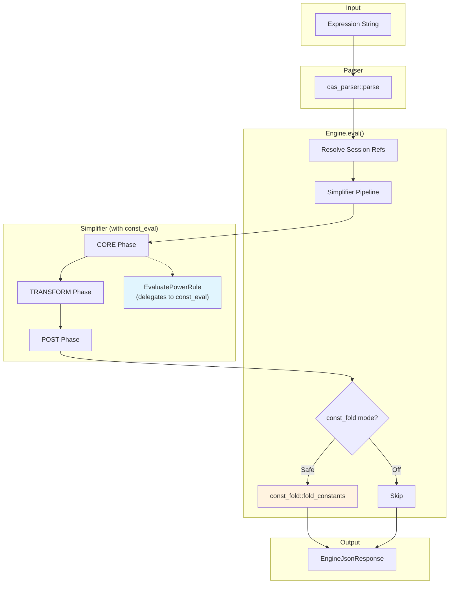

# CONST_FOLD_POLICY.md

## 1. Propósito

`const_fold` es una **capa opcional, acotada y auditable** para **plegar (evaluar) subexpresiones puramente constantes** que dependen de la **semántica de valores** (ℝ vs ℂ) y de la **política de rama** (branch).

Su objetivo es **añadir capacidad semántica controlada** (por ejemplo, `sqrt(-1)`), **sin mezclar** esa lógica con el simplificador simbólico general, y sin introducir suposiciones sobre variables.

---

## 2. Relación con otros módulos

### 2.1 `const_eval` (always-on, canónico, neutral)

* **Siempre activo**.
* Evalúa **ℚ^ℤ** (potencias con base racional y exponente entero) y casos límite (`0^0`, `0^-n`) de forma **domain-neutral**.
* **No** decide ℝ vs ℂ.
* Es el "single source of truth" para cálculo literal seguro.

Ejemplos típicos:

* `2^10 → 1024`
* `(3/4)^(-2) → 16/9`
* `0^0 → undefined`
* `0^(-3) → undefined`

### 2.2 `const_fold` (opcional, semántico)

* Puede hacer cosas que **requieren semántica**:
  * `sqrt(-1)` depende de `ValueDomain` (real vs complex)
  * operaciones con `i` solo si ℂ está habilitado (p.ej. `i*i → -1`)
* Está **gated** por `ConstFoldMode`.

### 2.3 Simplificador (rules CORE/TRANSFORM/…)

* Reglas simbólicas generales.
* Puede simplificar expresiones con variables (controladas por `DomainMode`, `InverseTrigPolicy`, etc.).
* **No** debería "forzar" semántica compleja en constantes si esa decisión está pensada para `const_fold`.

### 2.4 Diagrama de Pipeline

**Flujo:**

1. **Parser** → AST
2. **Simplifier** ejecuta reglas (CORE/TRANSFORM/POST)
   - `EvaluatePowerRule` delega ℚ^ℤ a `const_eval` (always-on)
3. **const_fold** (solo si `Safe`):
   - Aplica transformaciones semánticas (`sqrt(-1)` → `i` o `undefined`)
4. **Output** → JSON con resultado y steps

---

## 3. Configuración y ejes semánticos relevantes

`const_fold` depende únicamente de estos ejes:

* **ValueDomain**
  * `RealOnly`: ℝ extendida (con `±infinity`, `undefined`)
  * `ComplexEnabled`: ℂ habilitado (aparece `i`)
* **BranchPolicy**
  * `Principal` (por ahora; reservado para futuro multivaluado)
* **ConstFoldMode**
  * `Off`: no pliega nada (noop)
  * `Safe`: pliegue allowlist-only (ver §4)

**Importante:** `ValueDomain` **NO "tipa" variables**.
Solo afecta a **evaluación de constantes** cuando decidimos plegarlas. Las variables siguen siendo simbólicas.

---

## 4. Contrato de `ConstFoldMode`

### 4.1 Modo `Off`

**Garantía:** `const_fold(off)` es **semantic-noop**.

* No reescribe nada por semántica de ℝ/ℂ.
* No introduce `i` ni `undefined`.
* No altera subárboles constantes (más allá de lo que ya haga `const_eval` en su capa).

**Motivación:** permite **posponer decisiones semánticas** (ℝ/ℂ) y evitar "contaminar" expresiones simbólicas con `i/undefined`.

Ejemplo:

* `sqrt(-1) * x`
  * `off` → `sqrt(-1) * x` (residual, sin decidir)
  * `safe + real` → `undefined` (colapsa todo)
  * `safe + complex` → `i * x` (decide ℂ)

### 4.2 Modo `Safe`

`Safe` solo aplica un **allowlist** de transformaciones sobre subárboles **totalmente constantes**, respetando `ValueDomain` y `BranchPolicy`.

#### Allowlist V2 (actual)

* `sqrt(perfect_square)` → entero exacto
  * `sqrt(4) → 2`
* `sqrt(negative_literal)`
  * `RealOnly` → `undefined`
  * `ComplexEnabled + Principal` → `i` (caso `sqrt(-1)`) o `i * sqrt(|n|)` si está soportado por allowlist
* `i * i → -1` (solo si `ComplexEnabled`)
* `pow` literal (delegado a `const_eval`):
  * base racional, exponente entero (positivo o negativo, con límite de magnitud)
  * `(-1)^(1/2)`:
    * `RealOnly` → `undefined`
    * `ComplexEnabled` → `i` (permitido explícitamente)

#### No-goals (prohibido en Safe)

* No racionalización (`rationalize*`)
* No expansión agresiva (`expand*`, multinomial, etc.)
* No álgebra polinómica (`gcd_*`, `poly_*`)
* No simplificación general (`Simplifier`, `simplify_with_stats`, etc.)
* No suposiciones de dominio sobre variables (no depende de `DomainMode`)

---

## 5. Por qué `off` es útil aunque exista `ValueDomain`

`ValueDomain` define la **semántica disponible**, no obliga a aplicarla.
`const_fold(off)` significa:

> "Aunque el motor soporte ℝ/ℂ, NO introduzcas decisiones semánticas en constantes."

Esto es valioso para:

* **algebra formal** y transformaciones simbólicas donde no quieres colapsos (`undefined`) ni aparición de `i` todavía
* **pipelines** donde el cliente decide el dominio al final (por ejemplo, UI que permite alternar real/complex)
* **auditabilidad**: puedes afirmar que tu simplificación no tomó decisiones ℝ/ℂ salvo que el usuario lo active

---

## 6. Puntos de entrada y wiring

### 6.1 Entry point canónico

`const_fold::fold_constants(ctx, expr, cfg) -> Result<ExprId, CasError>`

* Se aplica **solo** si `ConstFoldMode == Safe`
* Se ejecuta como una pasada iterativa con budget asociado

### 6.2 CLI / JSON

* CLI:
  * `--const-fold off|safe` (default: `off`)
  * `--value-domain real|complex`
  * `--complex-branch principal`
* JSON output refleja:
  * `options.const_fold`
  * `semantics.value_domain`, `semantics.branch`

---

## 7. Budget y límites de seguridad

`const_fold` debe:

* cargar budget con una operación específica (p.ej. `Operation::ConstFold`)
* usar métrica de iteraciones / nodos creados si aplica
* respetar límites como:
  * `MAX_ABS_POW` / `MAX_NEG_POW` (en `const_eval`, delegado)

Objetivo: evitar plegados "gigantes" o explosiones de cómputo por literales enormes.

---

## 8. Enforcement: lint + contract tests

### 8.1 Lint (HARD FAIL)

Debe existir un lint de enforcement tipo:

* denylist de llamadas a:
  * `simplify*`, `expand*`, `rationalize*`, `poly_*`, `gcd_*`, etc.
* allowlist implícita: helpers canónicos (`const_eval`, predicates canónicos, builders canónicos…)

### 8.2 Contract tests (mínimo)

Debe cubrir:

* `Off` es noop:
  * `pow_off_noop`, `off_mode_preserves_sqrt_negative`
* `RealOnly`:
  * `sqrt(-1) → undefined`
* `ComplexEnabled`:
  * `sqrt(-1) → i`
  * `i*i → -1`
* No inventar:
  * `sqrt(x)` no cambia
  * `sqrt(2)` no cambia
  * `2^(1/3)` no cambia
* Consistencia:
  * `const_eval` y `const_fold` coinciden en ℚ^ℤ

---

## 9. Hotspots futuros

Si se amplía `const_fold`, estos son hotspots típicos:

* `log(negative_literal)`:
  * `RealOnly` → `undefined`/residual
  * `ComplexEnabled + Principal` → `ln(|n|) + i*pi` (si se decide)
* `pow` con exponente racional (raíces generales):
  * requiere BranchPolicy serio (multivaluado vs principal)
* trig/hyperbolic con literales complejos

**Regla de oro:** cualquier ampliación debe venir con:

* allowlist explícita
* denylist enforcement
* contract tests por caso
* wiring/JSON estable

---

## 10. Resumen

* `const_eval`: siempre-on, neutral, ℚ^ℤ.
* `const_fold`: opcional, semántico (ℝ/ℂ + branch).
* `off` existe para **posponer** decisiones ℝ/ℂ y evitar introducir `i/undefined` en expresiones simbólicas antes de tiempo.
* `safe` es allowlist-only y auditable (lint + tests).

---

## 11. Canonical Utilities

| Utility | Location | Purpose |
|---------|----------|---------|
| `try_eval_pow_literal` | `const_eval.rs` | ℚ^ℤ evaluation |
| `literal_rational` | `const_eval.rs` | Extract rational from expr |
| `literal_integer_i64` | `const_eval.rs` | Extract integer from expr |
| `MAX_ABS_POW` | `const_eval.rs` | Limit for exponent magnitude |

---

## History

- 2025-12-27: Initial architecture with `try_eval_pow_literal` (PR-CONST-EVAL)
- 2025-12-27: Extended with normative policy document
