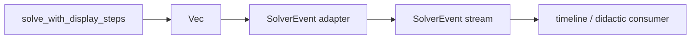
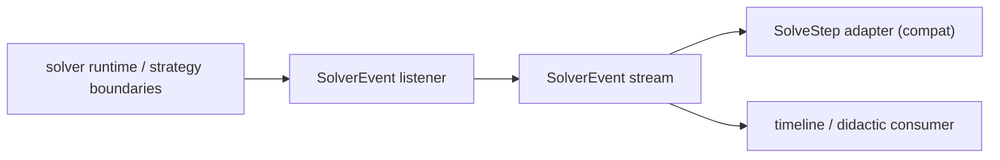

# Solver Event Observer Architecture

## Purpose

This document defines the next architectural phase after the pragmatic migration:
introducing a solve-specific observer/event model that allows didactic and
timeline layers to consume solver semantics without depending directly on the
internal `SolveStep` construction path.

The goal is not to redesign the whole solver. The goal is to add a stable,
equation-aware event spine for `solve`, similar in spirit to the existing
`EngineEvent` flow used by expression-based features.

## Why This Exists

The current event system already works well for expression-oriented flows:

- `eval --format json`
- `timeline_simplify`
- `full_simplify`

Those paths can use `EngineEvent::RuleApplied` because the payload is an
expression rewrite (`ExprId before/after`) and that is enough to synthesize
expression steps.

`solve` is different.

The didactic surface of `solve` depends on equation semantics:

- equation before/after a strategy
- strategy narration
- substeps attached to a main step
- isolation, swap-sides, collect-terms, rational exponents
- assumptions and diagnostics emitted alongside solving

`EngineEvent::RuleApplied` is not enough for that because it carries `ExprId`,
not `Equation`.

As a result, `solve` currently has its own didactic path built around:

- `StrategyDidacticStep`
- `StrategyExecutionItem`
- `SolveStep`
- `SolveSubStep`
- `DisplaySolveSteps`

That is acceptable for now, but it leaves the architecture asymmetrical:
expression flows have an event spine; solve flows do not.

## Architectural Value

Done correctly, a solve-specific event model gives us:

1. A stable didactic boundary for `solve`
   - Timeline, JSON and future narrator-style consumers can consume events
     instead of solver internals.

2. Reduced coupling between didactic consumers and runtime step assembly
   - Consumers stop caring about where `SolveStep` came from.

3. Better layering
   - `cas_solver_core` owns the canonical solve event model.
   - `cas_solver` owns orchestration and compatibility adapters.
   - `cas_didactic` consumes a stable semantic stream.

4. A controlled path toward a stricter observer architecture
   - Without forcing a risky rewrite of the solve pipeline.

## What We Are Not Trying To Do

This phase explicitly does **not** try to:

1. Replace `SolveStep` everywhere at once.
2. Rebuild `timeline_solve` from scratch.
3. Emit a low-level event for every internal solver mutation.
4. Model the full diagnostics space on day one.
5. Re-architect the entire solver runtime around listeners.

Those would create a much larger and riskier project than the one we want.

## Current Relevant Building Blocks

### Existing event model

- `cas_solver_core/src/engine_events.rs`

Current shape:

- `EngineEvent::RuleApplied { before, after, global_before, global_after, ... }`

Strength:

- good fit for expression rewrites

Limitation:

- not equation-aware

### Existing solve didactic model

- `cas_solver_core/src/strategy_kernels.rs`
  - `StrategyDidacticStep`
  - `StrategyExecutionItem`
- `cas_solver_core/src/solve_types.rs`
  - `SolveStep`
  - `SolveSubStep`

These are already the semantic center of solve narration.

### Existing solve consumers

- `cas_solver/src/timeline_solve_eval.rs`
- `cas_solver/src/solve_display_steps.rs`
- `cas_didactic/src/timeline/solve_timeline_render.rs`
- `cas_didactic/src/timeline/solve_render.rs`

These consumers work today, but they consume the materialized solve-step model,
not an event stream.

## Design Principles

The design must follow these principles:

1. Equation-aware
   - the payload must carry `Equation`, not `ExprId`

2. Stable and semantic
   - event names should describe didactic meaning, not internal plumbing

3. Minimal v1
   - model only what we already know is stable

4. Phaseable
   - first allow derived events from existing steps
   - only later decide whether native emission is worth it

5. Stop early if the value is not real
   - if the model does not simplify a consumer, we stop

## Proposed Core Model

### New module

Recommended new files in `cas_solver_core`:

- `cas_solver_core/src/solver_events.rs`
- `cas_solver_core/src/solver_event_collector.rs`

### Proposed event shape

```rust
pub enum SolverEvent<Equation, Importance> {
    StepProduced {
        description: String,
        equation_after: Equation,
        importance: Importance,
    },
    SubstepProduced {
        description: String,
        equation_after: Equation,
        importance: Importance,
    },
}
```

### Proposed listener

```rust
pub trait SolveEventListener<Equation, Importance> {
    fn on_event(&mut self, event: &SolverEvent<Equation, Importance>);
}
```

### Proposed collector

```rust
pub struct SolverEventCollector<Equation, Importance> {
    events: Vec<SolverEvent<Equation, Importance>>,
}
```

This is intentionally narrow.

It does **not** attempt to model:

- strategy rejection
- branch discard
- diagnostics deltas
- solution verification
- assumption scope changes

Those can be added later only if they prove necessary.

## Why This Shape

The proposed shape mirrors what is already stable in the solve didactic path:

- a main step with equation context
- optional substeps with equation context

That gives three advantages:

1. It is easy to derive from existing `SolveStep`.
2. It is easy to convert back into `SolveStep`.
3. It does not force the solver runtime to expose internal strategy mechanics
   before we know we actually need them.

## Architecture Strategy

The key decision is this:

### Phase 1 uses derived events, not native emission

In the first implementation, `SolverEvent` will be produced **from**
`Vec<SolveStep>`, not emitted by the solver runtime itself.

This keeps the change safe:

- no semantic risk
- no change to public API
- no change to solve algorithm behavior
- no need to thread listeners through the recursive runtime

This is the correct first step because it tells us whether the event model is
actually useful to consumers.

## Proposed Flow

### Phase 1 flow



### Phase 2 flow, only if justified



## Phase 1 Detailed Plan

### New core model

Add:

- `cas_solver_core/src/solver_events.rs`
- `cas_solver_core/src/solver_event_collector.rs`

### New adapter in `cas_solver`

Recommended adapter file:

- `cas_solver/src/solve_event_steps.rs`

Responsibilities:

1. Convert `Vec<SolveStep>` to `Vec<SolverEvent>`
2. Convert `Vec<SolverEvent>` back to `Vec<SolveStep>`
3. Preserve:
   - descriptions
   - equations
   - importance
   - main-step/substep grouping

### First consumer

Recommended first target:

- `cas_solver/src/timeline_solve_eval.rs`

Not because it is broken, but because it is the only place where solve didactic
events clearly matter as an architectural concern.

### Acceptance criteria

Phase 1 is done when:

1. `SolveStep -> SolverEvent -> SolveStep` roundtrips losslessly
2. `timeline_solve` can consume the event stream without behavior regressions
3. public API remains compatible

Current implementation status:

- `SolverEvent` and `SolverEventCollector` exist in `cas_solver_core`
- `SolveStep <-> SolverEvent` adapters exist in `cas_solver`
- `timeline_solve` already goes through a minimal event roundtrip path
- that integration is currently guarded by a shape-preserving fallback back to the
  original `DisplaySolveSteps`
- full renderer parity in `cas_didactic` remains the only unresolved part of
  Phase 1

## Phase 2 Detailed Plan

Phase 2 should happen only if Phase 1 proves value.

### Native emission points

If we go forward, the right native boundaries are not arbitrary solver helpers.
They are the already-semantified points around:

- `StrategyExecutionItem`
- `StrategyDidacticStep`

That makes these likely touch points:

- `cas_solver_core/src/strategy_kernels.rs`
- selected solve runtime orchestration helpers in `cas_solver_core`

### Emission rule

Emit only when the solver has already formed a didactic step boundary:

1. main strategy step produced
2. substep produced

Do **not** emit:

1. every failed attempt
2. every recursive internal call
3. every simplification helper inside a strategy

That would create noise and unstable semantics.

### Compatibility path

During Phase 2, `SolveStep` should still be derivable from events.
We should keep both until parity is proven.

## Potential Future Extensions

These are intentionally deferred:

1. `AssumptionRecorded`
2. `RequiredConditionAdded`
3. `SolutionCandidateProduced`
4. `SolutionVerified`
5. `StrategyRejected`
6. `BranchDiscarded`

These may be useful later, but they should not be part of the first event model.

## Risks

### 1. Duplicated models

We already have:

- `StrategyExecutionItem`
- `SolveStep`
- `SolveSubStep`

Adding `SolverEvent` introduces another layer.

Mitigation:

- keep v1 very small
- align it closely with existing step semantics

### 2. Zero practical benefit

We may discover that consumers still prefer `SolveStep`.

Mitigation:

- start with derived events
- stop if the consumer side does not get simpler

### 3. Over-design

The biggest risk is solving a hypothetical future problem.

Mitigation:

- no diagnostics events in v1
- no native emission in v1
- no rewrite of `timeline_solve`

## Stop Conditions

We stop after Phase 1 or Phase 2 if any of these happens:

1. consumers do not become simpler
2. event model starts mirroring `SolveStep` without adding architectural value
3. native emission requires touching too many solver runtime paths
4. test surface expands faster than maintainability improves

## Recommended Implementation Order

### Step 1

Implement:

- `SolverEvent`
- `SolveEventListener`
- `SolverEventCollector`
- `SolveStep <-> SolverEvent` adapter

### Step 2

Hook a single consumer:

- `timeline_solve`

### Step 3

Re-evaluate.

Decision:

- if useful: continue to native emission
- if not useful: keep the adapter layer and stop

### Step 4, only if justified

Introduce native emission at strategy boundaries using:

- `StrategyExecutionItem`
- `StrategyDidacticStep`

## Recommended Go / No-Go Decision

### Go

I recommend doing:

- Phase 1
- Phase 2 consumer integration

### No-Go, for now

I do **not** recommend immediately doing:

- full native emission
- diagnostics/assumptions events
- replacement of `SolveStep`

## Summary

This phase is valuable **only** if kept narrow.

The right design is:

1. a minimal, equation-aware `SolverEvent`
2. derived first from `SolveStep`
3. adopted first by `timeline_solve`
4. reevaluated before touching solver internals

That gives us a real architectural improvement without turning the solve
pipeline into a speculative rewrite.
